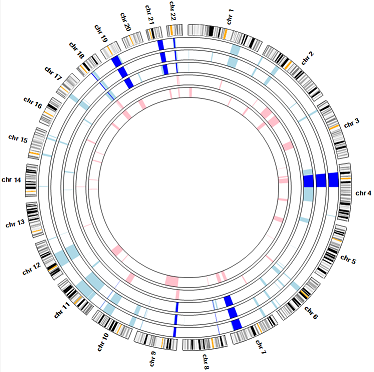

# AgileMultiIdeogram



````AgileMultiIdeogram```` displays the locations of autozygous regions from multiple individuals against a circular or linear ideogram of Chromosomes 1–22. The autozygous regions can be automatically identified from either exome variant data or microarray SNP genotype data or imported as predefined regions in a text file.  
Exome variant data must be formatted as VCF files, while SNP genotypes can be in the old __*.xls__ tab-delimited format or the newer ‘birdseed’ format that is currently exported by the Affymetrix genotyping console. Data from Illumina microarrays may also be used, once reformatted using one of the programs <a href="http://www.dna-leeds.co.uk/illumina2affy/">here</a>.


### Guide

```AgileMultiIdeogram``` user guide can be found [here](guide/README.md).

### Download

The compiles ```AgileMultiIdeogram``` program can be downloaded [here](download/).


