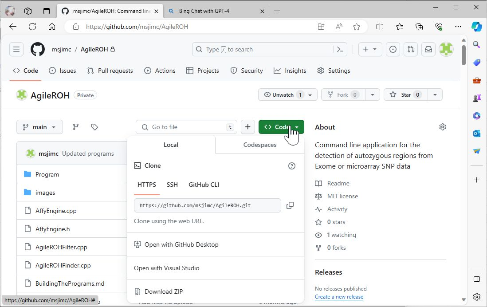
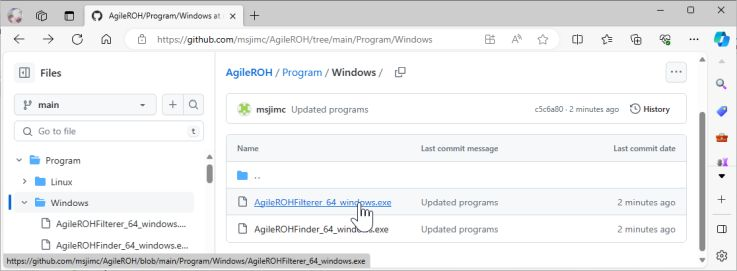
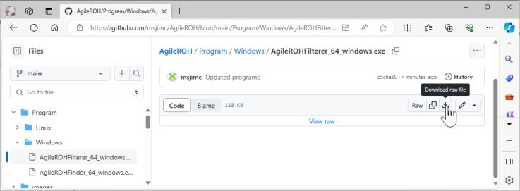
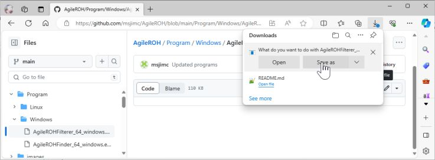
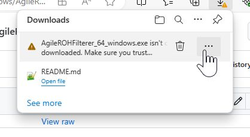
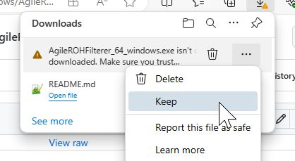
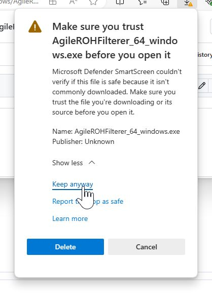

# Downloading program

It is possible to download the whole of this GitHub repository by selecting the green 'Code' button (Figure 1) and either selecting the 'Download ZIP' option: This will download the whole repository. Alternatively, if you wish to build the program yourself and have a version of Visual Studio installed, you can use the 'Open with Visual Studio' option to download the source code, which is then opened in Visual Studio. You may need to close Visual Studio and reopen it by selecting the projects *MultiIdeogram_CS.sln* file to gain full functionality of Visual Studio.

### Note
The images show the selection of the ```AgileROHFinder``` program, but the process is the same.


Figure 1

<hr />

The process of downloading the compiled program may be involved due to security policies of certain organisation a Windows computer. First navigate to the download folder and click on the program (Figure 2)



Figure 2

<hr />

Then click on the 'Download' icon (Figure 3)


Figure 3

<hr />

Select 'Save as' (Figure 4) 


Figure 4

<hr />

This will create a warning message, click on the three ellipses (Figure 5)


Figure 5

<hr />

and select 'Keep' (Figure 6)


Figure 6

<hr />

On the next warning message select 'Show more' followed by the 'Keep anyway' link (Figure 7)


Figure 7

<hr />

This should then allow you to save the program. Once it is downloaded, you may have to move the program to a different folder/drive as downloaded programs are sometimes saved to folders with reduced permissions that stop programs running.