# AgileMultiIdeogram

## User guide
### Introduction

```AgileMultiIdeogram``` displays the locations of autozygous regions in multiple individuals one chhromosome at a time or against a linear or circular ideogram of chromosomes 1–22. The autozygous regions can be supplied as predefined regions in a text file or they can be automatically identified either from exome variant lists or microarray SNP genotype data.

### Important note  
```AgileMultiIdeogram``` is designed to work on VCF and microarray genotype data files that contain variant data for a single individual per file. If a file contains data for multiple individuals it will only process data for one sample.

## No regions reported or errors reported

If your data files produce no regions or cannot be processed, press the ***Help*** > ***Test file format*** to check a data file's format and data content as described [here](TestDataFileFormat.MD).

### Entering data
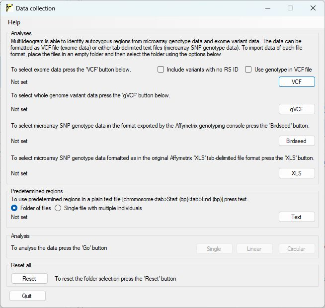
		
Figure 1: User interface of ```AgileMultiIdeogram```
	
```AgileMultiIdeogram``` works with predefined regions in a text file(s), variant data derived from microarray SNP genotyping or high throughput sequencing (*.vcf, *.vcf.gz, *.g.vcf or *.g.vcf.gz) or any combination of them.
	

#### NGS variant data

***Important Note: VCF files should only contain data for a single individual.*** 

To use NGS derived variant data, save the variants in the VCF format with the '__*.vcf__' file extension or with optional compression using gzip with the '__*.vcf.gz__' file extensions and place all these VCF files in an empty folder and select it by pressing the ```VCF``` button. Likewise, when using variant data formatted as genome VCF files as '__*.g.vcf__' or with compression as '__*.g.vcf.gz__' files, place the files in a single folder and select this folder using the ```gVCF``` button.   

 Do not mix *.vcf and *.g.vcf files in the same folder. 

##### VCF analysis Options

By default variants without an RS id are ignored, ticking the ```Include variants with no RS ID``` checkbox option will override this behaviour and include all single base variants. 

When processing a variant ```AgileMultiIdeogram``` uses the read depth data of the alleles to determine the variants genotype rather than use the value in the VCF files. However, checking the ```Use genotype in VCF file``` checkbox will direct ```AgileMultiIdeogram``` to use the genotype in the VCF file. For high quality data derived from  alignments with a high read depth, this option makes little difference, but for data derived from lower read depth data or variants called with relaxed parameters, this may adversely affect the analysis. 

Selecting ```Use genotype in VCF file``` or ```Include variants with no RS ID``` will affect all the VCF files in an analysis, but not the g.vcf files.  
	
#### Microarray SNP genotype data

Microarray SNP genotype data can be formatted either as ‘birdseed’ files with the '__*.txt__' file extension (these files are exported by the Affymetrix Genotype Console) or in the old Affymetrix ‘__*.xls__’ tab-delimited genotype format. Data from other platforms (such as Illumina microarrays) can be used after reformatting using a <a href="http://www.dna-leeds.co.uk/illumina2affy/">data conversion utility</a>. As before, microarray data files should be placed in an empty folder.‘Birdseed’ data files or those in the old tab-delimited format can then be selected using the ```Birdseed``` or ```XLS``` button, respectively.

***Microarray genotype data files should only contain data for single individual.***
	
#### Predefined regions
To use predefined regions create a text file for each person and enter the regions (one per line) in the following format: 

Chromosome number&lt;tab&gt;Start point in bp&lt;tab&gt;End point in bp.   

Place the files in an empty folder and select the folder using the ```Text``` button with the *Folder of files* option selected. ```AgileMultiIdeogram``` can export all regions identified 
in a patient cohort to a single text file, to import this data select the file using the ```Text``` button with the *Single file with multiple individuals* option selected.

Once the relevant data folders have been selected, the *Single*, *Linear* and *Circular* buttons will become active and by pressing one the regions will be visualised as a single chromosome, a linear ideogram or circular ideogram respectively after the affected individuals have been selected using the ```Affecteds``` window as shown below in Figure ;2.

### Identifying data from affected patients

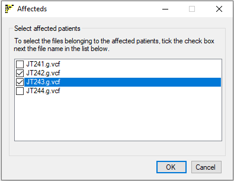

Figure 2: Data files from affected subjects are selected using the ```Affecteds``` window
	

Data files from affected individuals must now be identified, by ticking the check boxes next to their filenames. Once the disease status appropriate to each file has been specified, the analysis is started by clicking ```OK```. This will close the current window and open a new ```Ideogram viewer``` window as shown in Figures 3, 7 and 8.

### Analysing and visualising the data

***No regions reported or errors reported:*** If your data files produce no regions or cannot be processed, press the ***Help*** > ***Test file format*** to check a data file's format and data content as described [here](TestDataFileFormat.MD).

Since processing the data may take several minutes, the data is displayed as each files is processed. Consequently, the images initially contain just the cytogenetics banding patterns for each chromosome (e.g. figure 3), before each individual's data is added in turn. While its possible to view data in different ways, the menus on each of the windows consist of a core set of options, with only the ```Single chromosome view``` containing more options, consequently, the core set of options will be described once in the ```Linear ideogram view``` section.
	
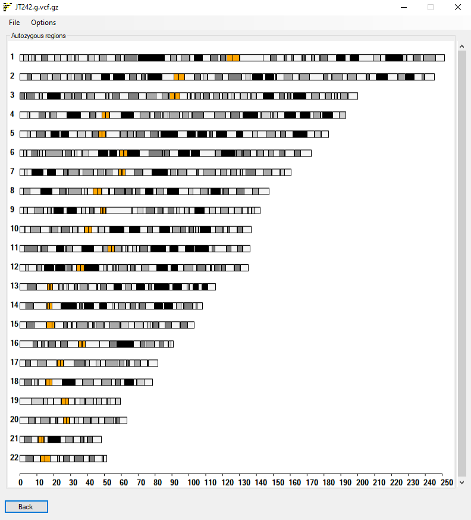

Figure 3: Initial display of the ```Linear Ideogram viewer ```window

Initially, the ```Linear Ideogram viewer``` window only contains the linear display of the ideograms of the autosomes (Figure 3). As each file is analysed, its name is displayed in the window title bar, while the autozygous regions from previously analysed files are displayed in the the main window (Figure 4).
	
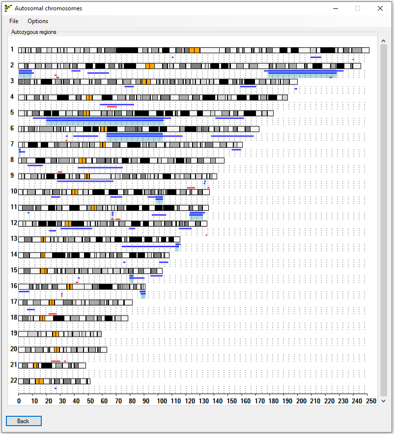

Figure 4: Completed analysis, showing the display of autozygous regions in affected (blue) and unaffected (red) subjects
	
Once the analysis is complete, the '''Linear Ideogram viewer''' window will display the autozygous regions in each input file, as a series of thick lines (Figure 4). Autozygous regions from affected individuals are coloured blue, while those from unaffected individuals are red. Where a region is homozygous in all affected individuals, the region is highlighted as a pale blue rectangle. Note that since the data used can come from a wide range of sources it is possible that these overlapping autozygous regions are not concordant and unaffected individuals may be homozygous for the same haplotypes. (For a discussion of concordant and non-concordant autozygosity, see <a href="http://www.ncbi.nlm.nih.gov/pubmed/19405095">here</a>.) If it is desirable to take into account the shared or discordant haplotype status of the regions among different affected individuals, SNP microarray genotyping is preferred, and should be analysed using an appropriate tool such as <a href="https://www.dna-leeds.co.uk/autosnpa">AutoSNPa</a>. (Alternatively, NGS data may be analysed using <a href="https://www.dna-leeds.co.uk/agile/AgileVCFMapper">AgileVCFMapper</a>.) None of these programs currently offers the possibility to compare variant haplotypes across datasets incorporating both microarray and NGS data.  
There is no limit to the number of individuals this window will display, if the image becomes taller than the viewing area, the vertical scroll bar to the right of the image becomes active, allowing the image to be scrolled up and down.
	
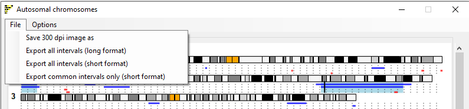

Figure 5: The *File* menu on each of the ```Viewer windows``` allows the regions data to be saved as either a text or image files.

* The *File* menu on each of the ```Viewer windows``` allows the regions data to be saved as either text or image files. 
  * The *Save 300 dpi image as...* menu option allows the current image to be saved as a publication ready TIFF file.
  * The *Export all intervals (long format)* menu option saves all the autozygous region data to a single file. The data for each original data file follows a line containing the file's name and then a column header line. Each region is then written as: Chromosome number&lt;tab&gt;start point (bp)&lt;tab&gt;End point (bp)&lt;tab&gt;region length (bp). At the end of the file the regions common to all the affected individuals	are listed.  
  * The *Export all intervals (short format)* menu option allows the regions to be save as described above except each region's line is formatted as: "chr"chromosome number&lt;colon&gt;start point (bp)&lt;hyphen&gt;end point (bp). This format can be pasted directly in to various third party applications/web pages like The Genome browser or IGV allowing the contents of the regions to be viewed.
  * The *Export common intervals only (short format)* menu option saves only the common regions to file, in the short format described above.
	
##### The *Options* menu
	
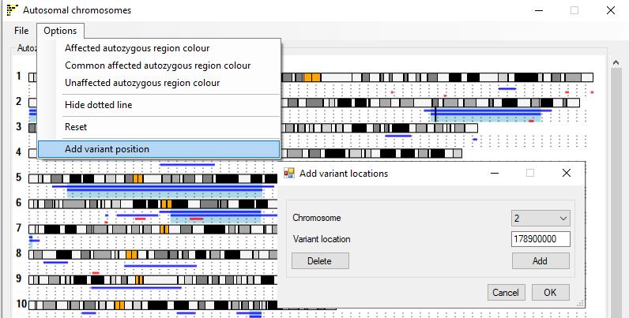

Figure 6: The *Options* menu on each of the ```Viewer windows``` allows the image to be modified.

* The *options* menu contains several sub-menus:
  * The *Affected autozygous region colour*, *Common affected autozygous region colour* and 	*Unaffected autozygous region colour* menu options allow the colours used to highlight autozygous regions to be changed.
  * The *Hide dotted line* menu option is used to either hide or show the dotted lines that help to identify regions that occur in the same individual.
  * The *Reset* menu option resets the style of the image to the original default style.
  * The *Add variant position* menu option allows the user to highlight a single position in the genome such as the position of a gene or variant of interest.    
  Selecting the option opens the ```Add variant locations``` window (figure 6) which allows the position to be entered. If the *Delete* button is pressed followed by the *OK* button the current position is deleted.
	
#### Circular ideogram
As with the ```Linear Ideogram viewer``` window, initially, the ```Circular Ideogram viewer``` window only contains the circular display of cytogenetics bands of the autosomal chromosomes. As each file is analysed, its name is displayed in the window title bar, while the autozygous regions from previously analysed files are displayed in the the main window (Figure 7).
	
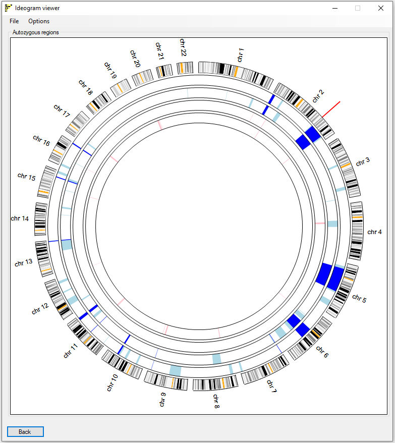

Figure 7: Completed analysis, showing the display of autozygous regions in affected (pale blue) and unaffected (pink) subjects, while common regions to all affected individuals are shown in dark blue. The red mark (against chromosome 2) identifies the location of a position of interest entered via the *Add variant position* menu option .

Once the analysis is complete, the  ```Circular Ideogram viewer``` window will display the autozygous regions in each input file, as a series of block arcs (Figure 7). Autozygous regions from affected individuals are coloured pale blue, while those from unaffected individuals are pink. Where a region is homozygous in all affected individuals, the arcs are displayed in a darker blue. Note that since ```AgileMultiIdeogram``` does not store haplotype data for these regions, it is possible that these overlapping autozygous regions are not concordant. (For a discussion of concordant and non-concordant autozygosity, see <a href="http://www.ncbi.nlm.nih.gov/pubmed/19405095">here</a>.) If it is desirable to take into account the shared or discordant haplotype status of the regions among different affected individuals, SNP microarray genotyping is preferred, and should be analysed using and appropriate tool such as <a href="https://www.dna-leeds.co.uk/autosnpa">AutoSNPa</a>. 	(Alternatively, NGS data may be analysed using <a href="https://www.dna-leeds.co.uk/agile/AgileVCFMapper">AgileVCFMapper</a>.) None of these programs currently offers the possibility to compare variant haplotypes across datasets incorporating both microarray and NGS data.  

This image only allows the data for a maximum of 11 individuals to be displayed.

* *Menu options*: This window contains the same menu structure as the ```Linear Ideogram viewer``` window, with the exception of the *Hide dotted line* menu option. When a position of interest is added, it is drawn as a red line outside of the cytogenetics banding circle.
	
#### Single chromosome viewer

As with the other windows, the ```Single Chromosome viewer``` window doesn't contain any patient specific data just the ideogram of chromosome 1 when it first appears
with the regions data added as the genotype data is processed (Figure 8). Like the ```Linear Ideogram viewer``` window, autozygous regions are shown as thick lines, below the ideogram of the currently selected chromosome. The chromosome is selected using the drop down list at the bottom right of the window.
	
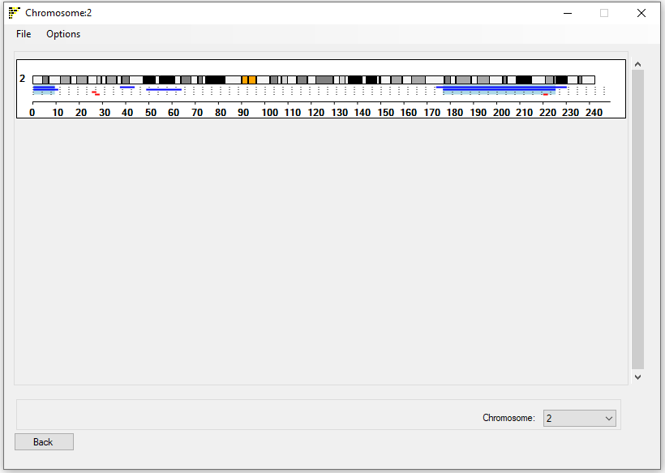

Figure 8: Exporting and customizing the display image	
		
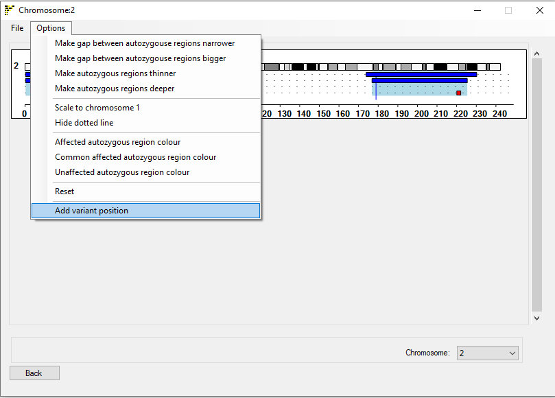

Figure 9: Completed analysis, showing the display of autozygous regions in affected (blue) and unaffected (red) subjects

* *Menu options*: This window contains the same menu structure as the ```Linear Ideogram viewer```*window, except of the inclusion of 5 menu options (figure 9):
*The *Options* menu contains 5 new extra options:
  1) The *Make gap between autozygous regions bigger* and *Make gap between autozygous regions narrower* menu options increase and decrease the gap between the consecutive individuals (compare Figure 8 to 9).
  2) The *Make autozygous regions deeper* and *Make autozygous regions thinner* menu options increase and decrease the thickness of the blocks used to show the extent of the autozygous regions (compare Figure 8 to 9).
  3) The *Scale to chromosome 1* menu option sets whether the selected chromosome spans the entire image or is drawn to the same scale as chromosome 1 would be.   

<hr />

## User case: CHRNG 

  To show the use of ```AgileMultiIdeogram``` download the [CHRNG.zip](../download/CHRNG.zip) file and extract the contents to an empty folder.

#### Selecting the files
Start ```AgileMultiIdeogram``` and select the folder of VCF files by pressing the ```VCF``` button (blue box in figure 10). 

 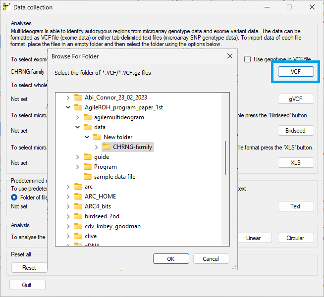

Figure 10: Selecting the data files.

<hr />

#### Selecting the image style

Next Select the type of image you require: single chromosome, linear ideogram or circular ideogram by pressing the ```Single```, ```Linear``` or ```Circular``` buttons respectively (blue box in figure 11).

 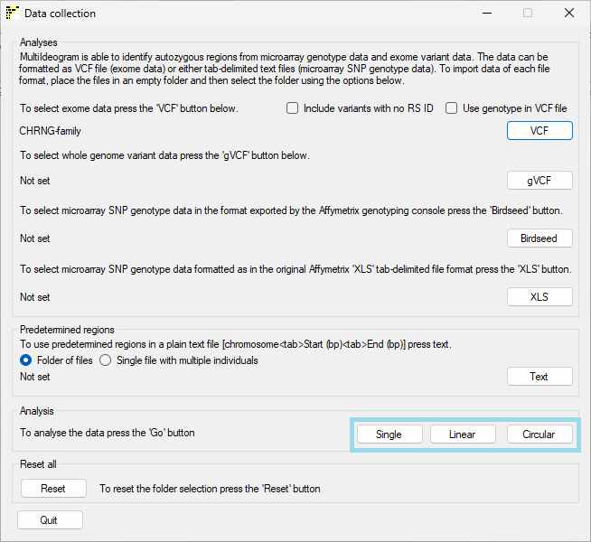

Figure 11: Selecting the image display.

<hr />

#### Identifying affected individuals

This will open the ```Affected``` window which allows you to identify which samples originate from affected individuals (Figure 12), in this case it is vcf files CHRNG-9.vcf and CHRNG-10.vcf. 

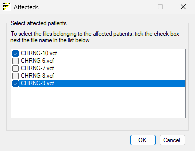

Figure 12: Selecting the affected individuals

<hr />

Pressing the ```OK``` button will then open the appropriate image viewer window which will be populated as each individual is analysed (see Figures 4, 7 and 8 above and Figure 13 below).

Since the affected individuals were selected, their autozygous regions are shown as pale blue arcs, while autozygous regions in the unaffected individuals are shown as pink arcs. Autozygous regions that are common to the affected individuals are highlighted as dark blue arcs. 

The CHRNG gene is located on chr2 at 232,539,692 bp to 232,548,115 bp, which is in or close to the only dark blue arc. To determine if the gene is in this region of common autozygosity region, select the ```Options``` >  ```Add variant position``` menu option (Figure 13)

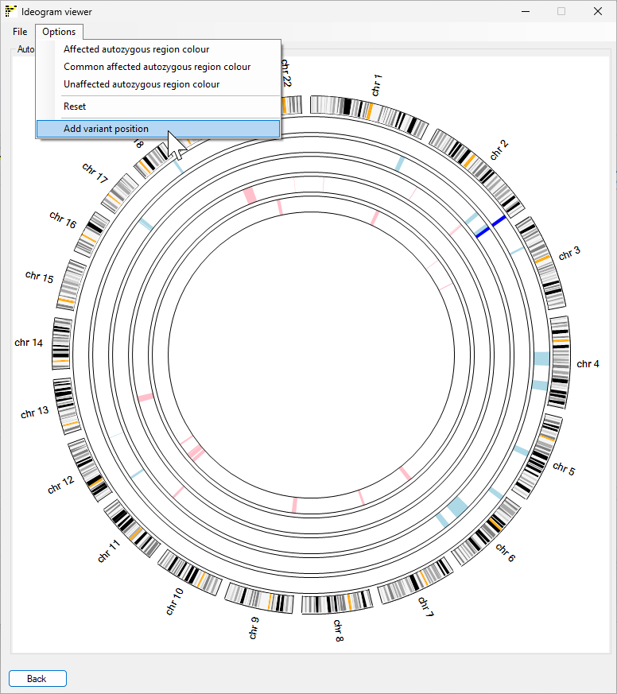

Figure 13: The circular ideogram viewer window showing the autozygous regions of individuals in a family affected by a CHRNG mutation.
<hr />

#### Highlighting the location of a gene or variant of interest

Selecting ```Options``` >  ```Add variant position``` menu option will open the ```Add variant locations``` window (Figure 14). Select the gene's chromosome (2) from the dropdown list and enter the genes position (232,539,692) in the text box. Due to the scaling of the image it is unlikely that choosing the start, end or middle of the gene will make a noticeable difference. The location will be accepted when the ```Add``` button is pressed and the location highlighted when the ```OK``` button is pressed (Figure 15).

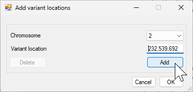

Figure 14: Entering the position of a possible disease gene.

<hr />

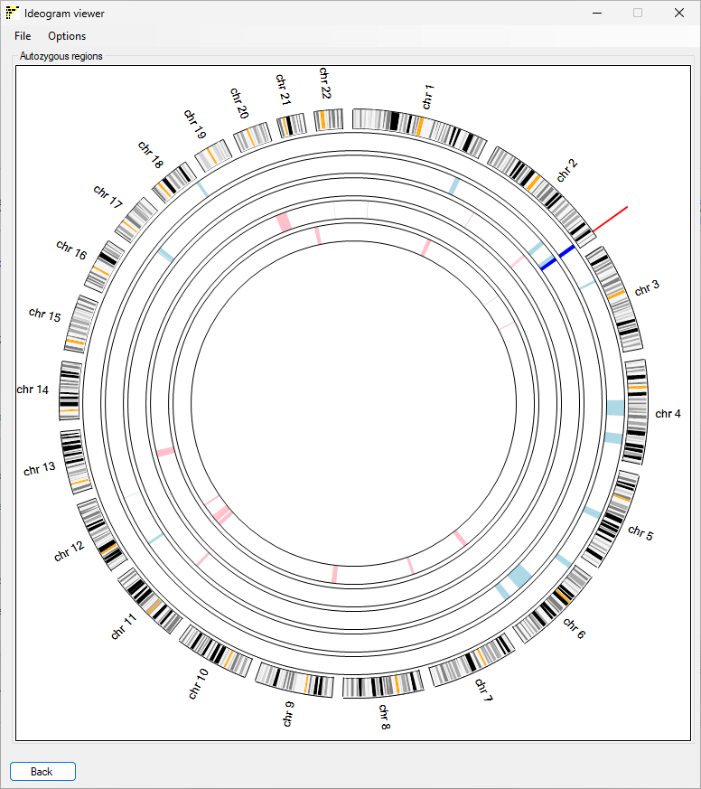

Figure 14: Highlighting the location of a possible disease gene.

<hr />

To remove or edit  the gene/variant location, select the ```Options``` >  ```Add variant position``` again and either press the ```Delete``` which will now be active or edit the previously entered location (Figure 16) and pressing the ```OK``` button to accept the change. 

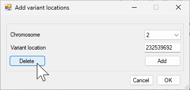 

Figure 15: Deleting or editing the current location.

<hr />

#### Saving the image to a 300 dpi image file

To save a high resolution image of the current ideogram, select the ```File``` > ```Save 300 dpi image as``` option (Figure 16) and enter the name of the image file as a 'tif' file ([example](images/chrng.tif)). As well as an image file, ```AgileAutoIdeogram``` will also save a text file that identifies the order in which the data is draw in the image (see Table 1 for the file structure)

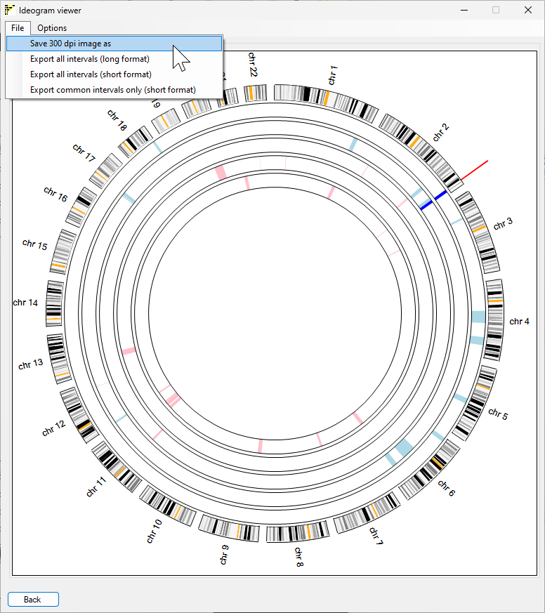

Figure 16: The  ```File``` > ```Save 300 dpi image as``` menu option will save the iame as a 300 dpi tif image.

Table 1

|Status|sample name|
|-|-|
|Files in analysis from the outside to the center||
|Affected|CHRNG-10.vcf|
|Affected|CHRNG-9.vcf|
|Unaffected|CHRNG-6.vcf|
|Unaffected|CHRNG-7.vcf|
|Unaffected|CHRNG-8.vcf|

#### Saving the autozygous regions to a file

It is possible to save the regions identified by ```AgileAutoIdeogram``` as either a tab-delimited text or as a location string that can be entered in to the ```UCSC genome browser``` or ```IGV```. The save options are accessed via the ```File``` menu (Figure 17)

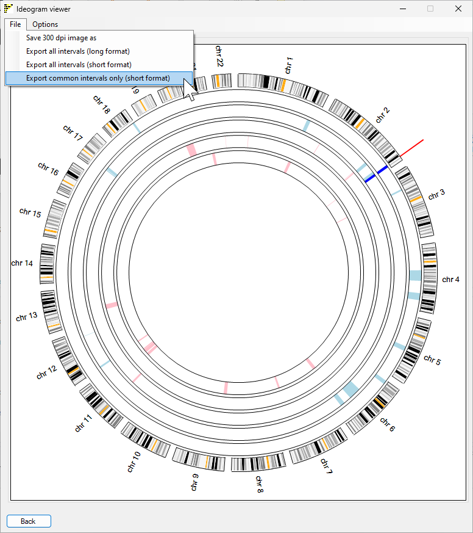

Figure 17: Save the regions to file


Example files: 
* ```Export all intervals (long format)```: [example file](images/longFormat.txt)  
* ```Export all intervals (short format)```: [example file](images/shortFormat.txt)  

It is also possible to save the autozygous region all the affected had in common by selecting the ```Export common intervals only (short format)```

Example file:
* ```Export common intervals only (short format)```: [example file](images/commonRegions.txt)